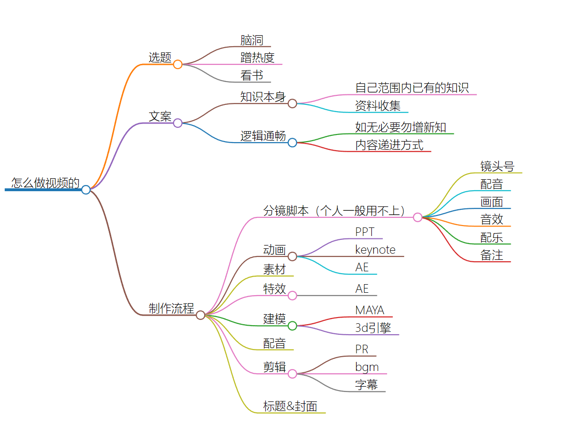
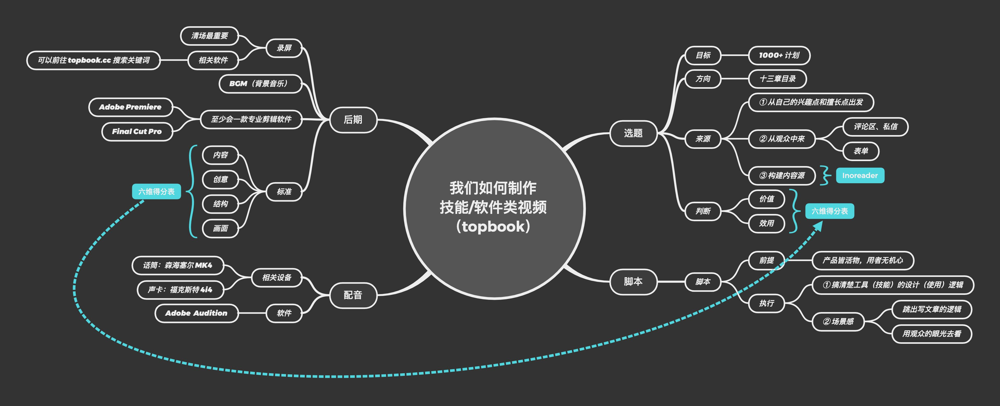

# 背景

事情是这样的。

我最近看了一本没看完的书叫做[《是什么带来力量》](https://book.douban.com/subject/25801138/)，是一个来中国支教的德国老哥写的，江湖人称卢安克。

这书带给我很大的启发，然后一顿了解后发现他人还在中国， 人有自己的网站：www.jiaoyu.org

作为一个前UI设计师，我第一眼就：哈哈哈哈，朴实无华。

打开控制台看代码，我惊了：table 表格法做网页，这是什么2000年做法。

点开看文章，这要挤死人的行间距，我立马手痒临时改一下。

然后我福至心灵，**为什么不给这个网站做个改版呢**？你让我改apple官网，那叫关公门前耍大刀，你让我给这个外行改，那提升空间很大了。

**为什么改版的过程和使用的方法不可以记录下来作为一种分享呢**？

要知道，我卢哥可是说了，要遵循内心的声音，于是我说干就干，开始规划。

# 前期准备

想法有了，但是还需要落实在行动上，哪怕是失败的尝试，也必须行动才能不停的修正认知。

## 这样的redesign是被允许的吗？

会有这样的问题是因为这不是原创，而是基于别人的创作进行的二次创作，然后[发现内在的自然 (jiaoyu.org)](http://www.jiaoyu.org/guanyu.htm) 这一页介绍：

> 下面注明蒙志合（我的网名）的内容代表我个人的一些梦想。《寻找内在的自然》和《没有期待的日子》是我以编故事的方式写了自己内在的经历。在下面写别人名字的内容代表别人的个人梦想。比如《山沟网》、《寻找内在的归属》和《园善合作社》是我朋友个人爱好的分享行为。我喜欢就收集了。

意思是网站一部分个人，一部分是他（经过允许后）收集的朋友的

> 《归属自然》虽然被朋友注册了，但这只是为了避免被第三者垄断。《发现内在的自然》和《归属自然》不是品牌，而是开放性和共享性的一种风格，任何有同样追求的人都可以使用。

很好奇为什么会有这个**避免被第三者垄断**的描述，查了[资料](https://www.zhihu.com/question/419893867)才发现，原来卢安克这个名字甚至不属于这位老哥，很好，一朝被蛇咬，立马长记性。
也就是说，归属自然，我甚至可以二创个LOGO。

> 如果你看到引用或利用本网站文字、照片或视频的其它文章或视频，你就需要知道：引用是允许的，但其中改过或增加的内容是其他人自己编辑的故事，与本网站无关。如果你看到他们增加了其他的人名进去，这种塑造人物形象的行为就是他们所喜欢的，与我和我做的这个网站没有什么关系。

网页有[知识共享许可协议](http://creativecommons.org/licenses/by-nc-sa/4.0/) 的说明，BY-NC-SA，充分了解可以[知识共享许可协议-搜索结果](https://search.bilibili.com/all?keyword=知识共享许可协议)自行查看

总结就是，我redesign了网站后，BY 说明要给出原网站和作者名字，NC，说明我的网站不可以获利，就是说，redesign了后，卖这个源码/设计图是不被允许的。SA说明我可以声称是和蒙志合一起创作的。

## 怎么做好这种分享？

```
有一定的写作属性，因为涉及到查资料+再次理解。
有一定的教程属性，因为redesign是需要实物支撑的，设计图/代码都是过程和结果中的产物。
有一定的探索属性，因为我没尝试过做这种分享，需要更有条理和结构的展示，而且有些知识需要现学。
```

首先我检索了B站，想看看别人怎么做的，这一阶段，我**以为是视频产出**。

[【新年回顾】我是怎么做视频的？](https://www.bilibili.com/video/BV1AF411i79H/) 下图采用[Try markmap](https://markmap.js.org/repl) 制作




但是细细一想，感觉不太对，因为这个视频的博主，是一位科学技术原理领域的科普博主，而我的产出，更有可能靠近一位网页实战类博主。

> me:
>
> > 一位内容多是科学技术原理的科普视频博主，和一位专精于网站项目制作的教学博主，他们的视频可能有什么异同点?
>
> chat GPT:
>
> > 这两位博主在科学技术原理和网站项目制作方面的视频内容上有一些共同点和差异点。
> >
> > 共同点：
> >
> > 1. 教育性质：两位博主的视频都具有教育性质，旨在向观众传授知识和技能。
> >
> > 2. 知识传递：两位博主都致力于向观众传递特定领域的知识。他们会解释复杂的概念、原理和技术，并通过实例和演示向观众展示如何应用这些知识。
> >
> > 3. 视频形式：无论是科学技术原理还是网站项目制作，视频都是这两位博主主要的内容形式。他们可能使用演示、图表、图像和动画等多种媒体来增强观众的理解和学习效果。
> >
> > 差异点：
> >
> > 1. 主题领域：两位博主的视频主题不同。科普视频博主专注于科学技术原理，如物理、化学、生物等领域的原理解释和应用。而网站项目制作教学博主专注于网站开发、编程语言、前端和后端技术等方面。
> >
> > 2. 视频内容深度：科普视频博主可能更加注重科学原理的解释和背后的理论基础，涉及较为复杂的科学概念和实验。而网站项目制作教学博主可能更加注重实际应用和技术实现，着重介绍如何使用工具和语言来构建网站项目。
> >
> > 3. 观众对象：由于内容不同，两位博主的观众对象可能有所差异。科普视频博主的观众可能更广泛，包括对科学和技术感兴趣的一般观众以及学生和研究人员。而网站项目制作教学博主的观众可能更加专业，包括对网站开发和编程有一定了解或者希望学习相关技能的人群。
> >
> > 总之，这两位博主的视频内容在主题领域和深度上有所不同，但都致力于教育观众并传递特定领域的知识和技能。

然后继续在B站搜索，但没什么收获，各种课程很多，但是没有讲解这样的课程应该怎么从0-1制作，最为靠近的视频应该是:[慕课类后期制作流程](https://www.bilibili.com/video/BV1AJ411h7EP), [【喵喵教程】如何制作一节微课](https://www.bilibili.com/video/BV1Ht411U7KV),但这两一个偏向后期技术，一个还是偏向过程技术。

随后找到一位 [我们是怎么做到60W+粉丝的？这是我们的创作流程！](https://www.bilibili.com/video/BV1y44y1q7jH/) :偏向技能和软件类分享的博主



这个更像指导原则的分享，感觉对实际干活没啥意义。因为人家是做工具指导和用法分享的博主，有点像但又不完全一样，于是我开始问chatGPT了：

> me:
>
> >  现在我想做一名分享网站制作内容的博主，准备从分析，整理，UI设计，直到编码完成。 为了做好课程，作为网站项目制作教学博主，你有什么建议和流程规划吗？
>
> chatGPT:
>
> >  作为一个网站项目制作教学博主，以下是一些建议和流程规划，帮助您准备和制作出优质的课程：
> >
> > 1. 确定目标受众：首先要确定您的目标受众是谁。是初学者还是有一定编程基础的学习者？这将有助于您调整课程内容和难度，以满足受众的需求。
> >
> > 2. 制定课程大纲：创建一个详细的课程大纲，涵盖从分析、整理到UI设计和编码等方面的内容。将大纲划分为逻辑和可管理的模块，以便于讲解和学习。
> >
> > 3. 选择适当的工具和技术：根据您的课程大纲，选择适当的工具和技术来展示网站项目的制作过程。这可能涉及到前端技术（如HTML、CSS、JavaScript）、后端技术（如Python、PHP）和相关的框架或库。确保选择的工具和技术能够满足您的教学目的并适应目标受众的水平。
> >
> > 4. 编写脚本和讲解：在准备录制视频之前，编写一个脚本，详细列出每个课程模块的主要内容和讲解要点。这将帮助您保持逻辑和流畅的讲解，并确保您不会遗漏重要的步骤和解释。
> >
> > 5. 制作示例项目：为了更好地演示网站项目制作的过程，创建一个示例项目。这个项目可以从头开始逐步展示分析、整理、UI设计和编码的过程。确保示例项目有足够的复杂性，可以涵盖您要讲解的核心概念和技术。
> >
> > 6. 录制和编辑视频：使用合适的录制设备和软件开始录制视频，并将录制的素材进行编辑。确保视频的质量良好，声音清晰，图像清晰可见。您还可以使用屏幕录制软件来展示代码编写过程和操作演示。
> >
> > 7. 提供练习和作业：在每个课程模块结束时，提供练习和作业，让学习者实践所学的知识。这有助于巩固他们的学习成果，并帮助他们在实际项目中应用所学的技能。
> >
> > 8. 互动和支持：与您的观众保持互动，回答他们的问题并提供支持。您可以在视频下方的评论区或者社交媒体平台上与他们进行交流，建
> >
> > 立起学习者社群，分享经验和解决问题。
> >
> > 9. 持续改进和更新：不断反思和改进您的课程，根据观众的反馈和需求进行调整。保持学习新技术和工具的态度，随时更新您的课程内容，以跟上行业的发展和变化。
> >
> > 希望这些建议能够对您成为一名成功的网站项目制作教学博主有所帮助！祝您好运！

很好，我觉得顿时非常的清楚了。

# 下一步规划

根据上面chatGPT的内容整理出计划文档：**01-流程规划**，怎么说，希望尽可能的体现出过程和思考。因为解决问题的思路和实践，涉及了怎么利用互联网已有的内容和工具，怎么去解决遇到的各种问题，怎么表达和视觉化。

# 致谢

chatGPT 使用了免费的[chat.zhile.io](https://chat.zhile.io) ，墙内可以访问且无需账号，非常感谢该网站制作者和账号贡献者.

